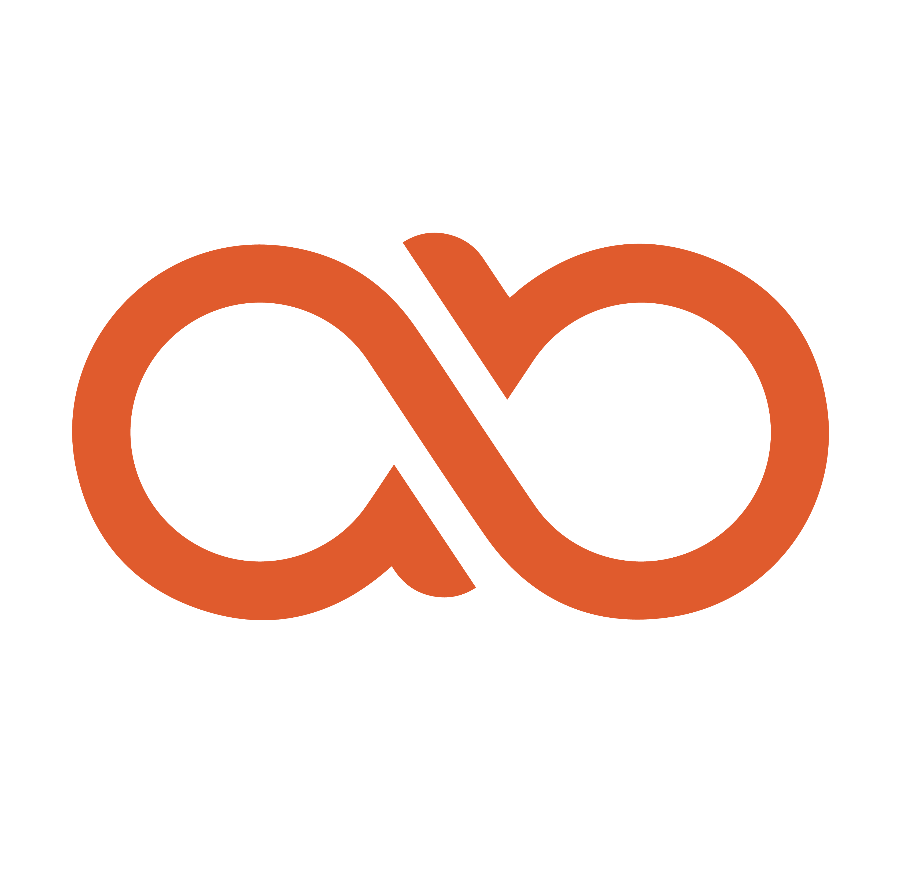

# AlphaByteCore

**Building category-defining software — one product at a time.**

*Chrome Extensions · AI-Native IDEs · Fintech Platforms · Flutter Apps*

---

## About

AlphaByteCore is an independent software company building bold, intelligent, and opinionated products across the full stack. We don't ship incremental tools — we build **category-defining experiences** that challenge what software should feel like.

Every product we ship is engineered with precision, designed with intent, and built to last.

> *"We build products that other companies haven't thought to build yet — and the ones they have, we build better."*

---

## Products

### 🧠 Singularity — AI-Native IDE &nbsp; `In Development`

A fully AI-native Integrated Development Environment built on a VSCodium fork. Not an AI plugin bolted onto a legacy editor — an IDE redesigned from the ground up with intelligence at its core. Competing directly with Cursor, Windsurf, and Google Antigravity.

- Native AI integration across the entire development workflow
- Built-in security vulnerability analysis
- 60+ feature roadmap with defined monetization model
- Freemium · Pro · Team tiers

---

### 🌐 Chrome Extension Suite — 12 Extensions

Making the browser the most powerful tool you own. All extensions are available at **[extensions.alphabytecore.com](https://extensions.alphabytecore.com)**.

| Extension | Category | What it does |
|---|---|---|
| 🛡️ **ZeroTrust** | Security | Real-time website threat scanning |
| 🎨 **ChromaStudio** | Design | Professional color picker & palette builder |
| 🔒 **PrivacyShield** | Privacy | Tracker & fingerprinting protection suite |
| 📎 **ClipMind** | Productivity | AI-powered web clipper with smart summaries |
| ✨ **NexusTab** | Productivity | Intelligence-grade new tab dashboard |
| 🔑 **VaultGuard** | Security | End-to-end encrypted password manager |
| 🔍 **SentinelX** | Security | AI-powered page threat scanner |
| 📌 **NotePin** | Productivity | Context-aware sticky notes for the web |
| 📸 **SnapFull** | Utility | Full-page & element screenshots |
| 🎯 **FocusGuard** | Wellness | Site blocker with Pomodoro timer |
| 🌤️ **SkyCast** | Utility | AI-powered hyper-local weather |
| 📡 **DevFeed** | Developer | Curated developer RSS & news feed |

---

### 💸 WealthSync — Fintech Ecosystem &nbsp; `Spec Complete`

A three-app fintech ecosystem targeting the Indian mutual fund distributor market — digitizing and streamlining the advisor-investor relationship end to end. Includes a Flutter advisor app, Flutter investor app, and a React admin panel.

---

## Philosophy

Three principles drive everything we build:

**① Intelligence First** — AI isn't a feature, it's the foundation.

**② Security by Default** — Every product ships with security built in, not bolted on.

**③ Category Design** — We don't enter markets. We define them.

---

## Roadmap

| Period | Milestone | Status |
|---|---|---|
| 2025 Q1–Q2 | Chrome Extension Portfolio — 12 extensions shipped | ✅ Done |
| 2025 Q3 | WealthSync — Architecture & full specification | ✅ Done |
| 2025 Q4 | Extension Hub — extensions.alphabytecore.com | ✅ Done |
| 2026 Q1 | Singularity IDE — Brand, strategy & 60+ feature roadmap | ✅ Done |
| 2026 Q2 | Singularity IDE — Alpha build & early access | 🔨 Active |
| 2026 Q3 | WealthSync — Beta launch (India) | 📅 Planned |
| 2026 Q4 | Singularity IDE — Public launch | 📅 Planned |
| 2027+ | Enterprise & SaaS tier expansion | 📅 Planned |

---

## Brand

| | |
|---|---|
| **Primary** | `#E05A2B` — Burnt Orange |
| **Dark Base** | `#14080A` — Warm Near-Black |
| **Logomark** | ∞ `ab` Infinity |
| **Design Language** | Dark-first · Type-led · Precision-crafted |

---

## Contributing

Core products are proprietary. Selected utilities and open components may be released over time.

For collaboration or contribution inquiries, open an issue or reach out directly.

---

## Contact

| | |
|---|---|
| 🌐 Website | [alphabytecore.com](https://alphabytecore.com) |
| 🔌 Extensions Hub | [extensions.alphabytecore.com](https://extensions.alphabytecore.com) |
| 🐙 GitHub | [github.com/alphabytecore](https://github.com/alphabytecore) |
| 📧 Email | hello@alphabytecore.com |
| 🐦 X / Twitter | [@alphabytecore](https://twitter.com/alphabytecore) |

---

## License

All AlphaByteCore products are proprietary unless explicitly stated otherwise in a repository's `LICENSE` file. Unauthorized use, reproduction, or distribution is prohibited.

© 2025–2026 AlphaByteCore. All rights reserved.

---

Built with obsession in 🇮🇳 India &nbsp;·&nbsp; <strong>AlphaByteCore ∞</strong>

